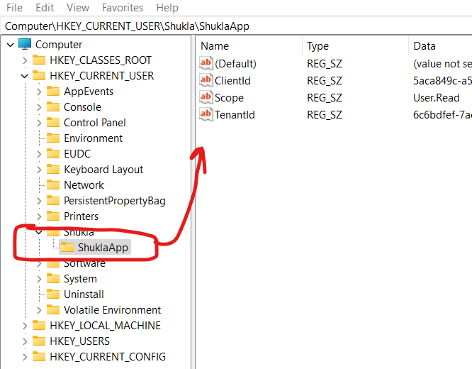
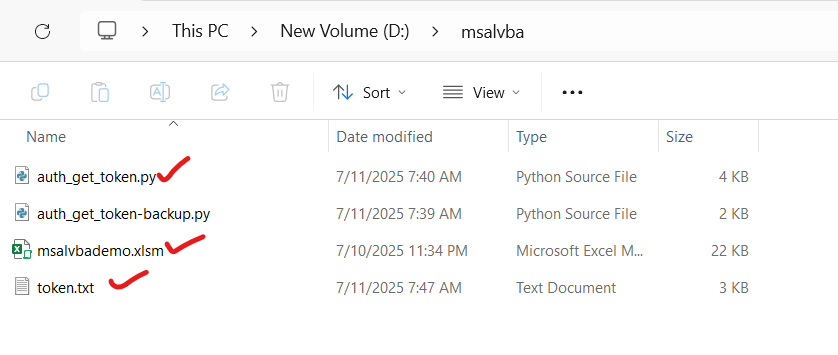
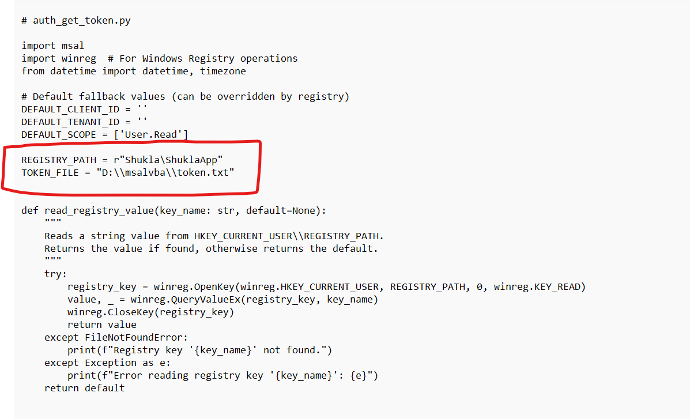
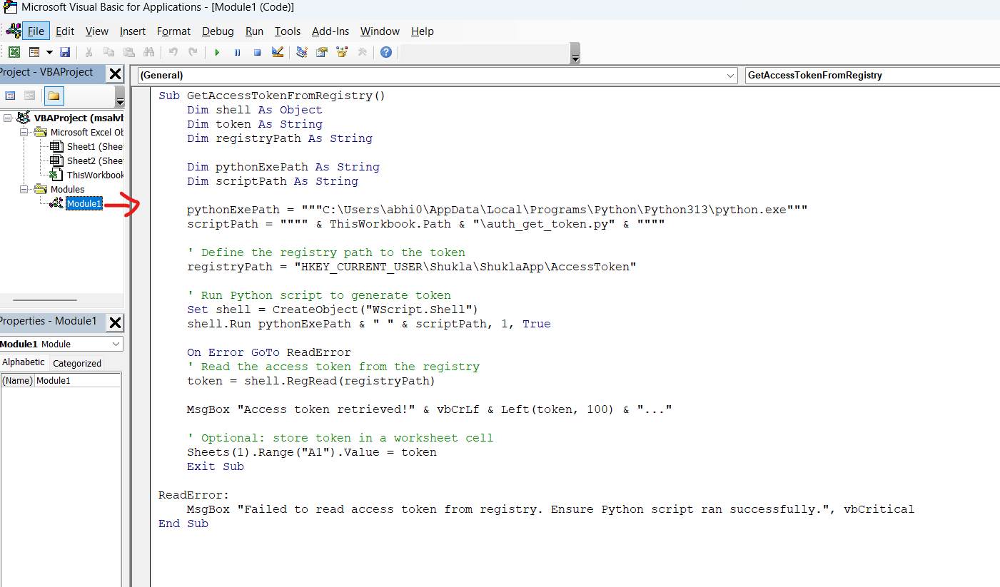
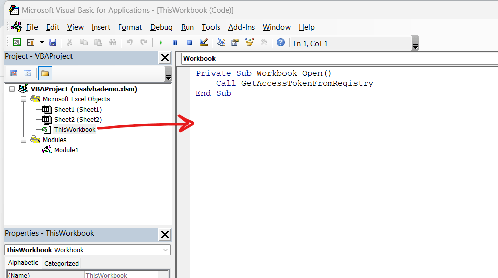
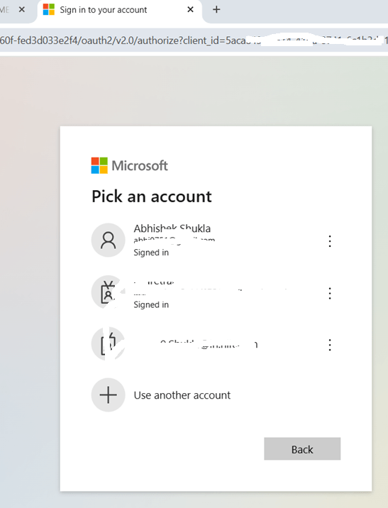
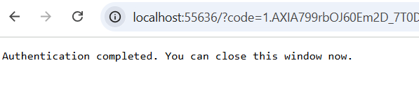
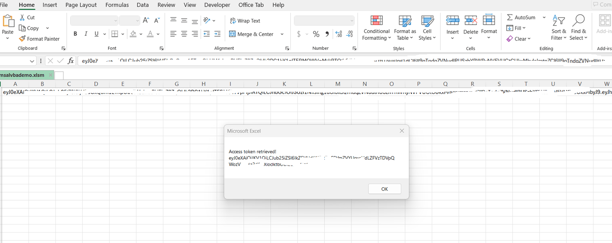
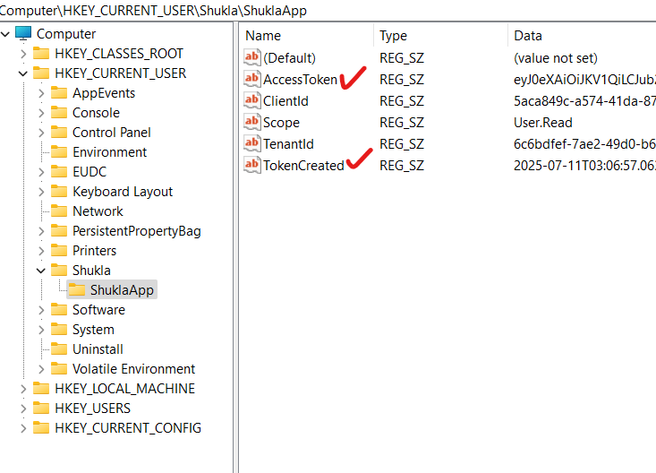
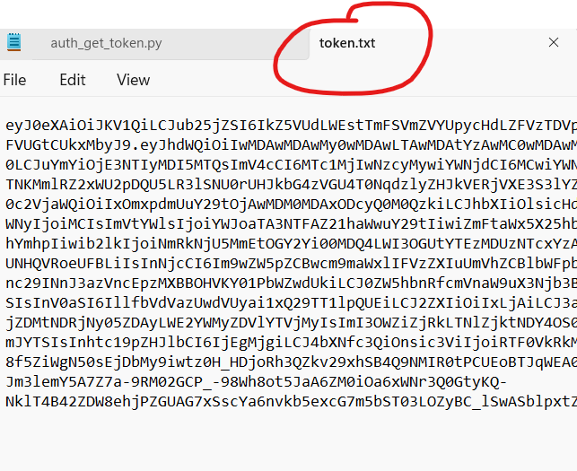

# Acquiring Azure Entra ID token in excel VBA

### Python Installation
1. Install Python (if not already installed)
Download and install Python from the official site:
https://www.python.org/downloads/

Make sure to check the box that says “Add Python to PATH” during installation.

2. Install the MSAL Library
Once Python is installed, open Command Prompt (or PowerShell) and run:

      pip install msal
      
To confirm msal installed correctly, you can run:

      python -c "import msal; print(msal.__version__)"

### Ensure your app is registered as a public client:

* Go to https://portal.azure.com:

* Navigate to Azure Active Directory > App registrations > Your App.

* Under Authentication, scroll to "Platform configurations".

* Ensure there is a "Mobile and desktop applications" platform added.

* Inside that, ensure "http://localhost/abc" is listed as a redirect URI.

* Also ensure "Allow public client flows" is enabled:
 
* Scroll to Advanced settings and set "Allow public client flows" to Yes.

```plaintext
Do NOT use client_secret or client_assertion in public client flows.

MSAL's PublicClientApplication does not require them and will throw that error if Azure expects them.
```


# Setup Windows Registry
Add your 
```plaintext
Client ID, Scope, TenantId
```

in registry. This should be in "Computer\HKEY_CURRENT_USER\"

Registry folder names you can choose as per your need, this will use in python code and VBA code



# File Structure in Folder

All these files must be in same folder


# Open auth_get_token.py
Open this python file and adjust the path as per your folder location.

This code will Read the ClientID, TenantID and scope from Registry.

This code will also write the acquired Token to Registry and Token.txt File.

This token from Registry will further read by VBA code.

Define these parameter values 
```plaintext
REGISTRY_PATH = r"Shukla\ShuklaApp"
TOKEN_FILE = "D:\\msalvba\\token.txt"
```


```python
# auth_get_token.py

import msal
import winreg  # For Windows Registry operations
from datetime import datetime, timezone

# Default fallback values (can be overridden by registry)
DEFAULT_CLIENT_ID = ''
DEFAULT_TENANT_ID = ''
DEFAULT_SCOPE = ['User.Read']

REGISTRY_PATH = r"Shukla\ShuklaApp"
TOKEN_FILE = "D:\\msalvba\\token.txt"


def read_registry_value(key_name: str, default=None):
    """
    Reads a string value from HKEY_CURRENT_USER\\REGISTRY_PATH.
    Returns the value if found, otherwise returns the default.
    """
    try:
        registry_key = winreg.OpenKey(winreg.HKEY_CURRENT_USER, REGISTRY_PATH, 0, winreg.KEY_READ)
        value, _ = winreg.QueryValueEx(registry_key, key_name)
        winreg.CloseKey(registry_key)
        return value
    except FileNotFoundError:
        print(f"Registry key '{key_name}' not found.")
    except Exception as e:
        print(f"Error reading registry key '{key_name}': {e}")
    return default


def store_token_in_registry(token):
    """
    Stores the token and creation time in the registry under HKEY_CURRENT_USER\\REGISTRY_PATH.
    """
    try:
        registry_key = winreg.CreateKey(winreg.HKEY_CURRENT_USER, REGISTRY_PATH)
        winreg.SetValueEx(registry_key, "AccessToken", 0, winreg.REG_SZ, token)

        timestamp = datetime.now(timezone.utc).isoformat()
        winreg.SetValueEx(registry_key, "TokenCreated", 0, winreg.REG_SZ, timestamp)

        winreg.CloseKey(registry_key)
        print("Token and creation time saved to Windows Registry.")
    except Exception as e:
        print(f"Failed to write to registry: {e}")


def get_token():
    client_id = read_registry_value("ClientId", DEFAULT_CLIENT_ID)
    tenant_id = read_registry_value("TenantId", DEFAULT_TENANT_ID)
    scope_str = read_registry_value("Scope", ",".join(DEFAULT_SCOPE))

    if not client_id or not tenant_id:
        print("Client ID or Tenant ID is missing in registry and no default is set.")
        return None

    authority = f"https://login.microsoftonline.com/{tenant_id}"
    scopes = [s.strip() for s in scope_str.split(",")]

    app = msal.PublicClientApplication(
        client_id=client_id,
        authority=authority
    )

    result = None
    accounts = app.get_accounts()

    if accounts:
        print("Pick the account you want to use to proceed:")
        for a in accounts:
            print(a["username"])
        chosen = accounts[0]
        result = app.acquire_token_silent(scopes, account=chosen)

    if not result:
        result = app.acquire_token_interactive(scopes=scopes)

    if "access_token" in result:
        print("Access token acquired.")
        return result["access_token"]
    else:
        print("Failed to acquire token.")
        print("Error:", result.get("error"))
        print("Description:", result.get("error_description"))
        print("Correlation ID:", result.get("correlation_id"))
        return None


if __name__ == "__main__":
    token = get_token()
    if token:
        with open(TOKEN_FILE, "w") as f:
            f.write(token)
        print(f"Token saved to {TOKEN_FILE}")

        # Save to registry
        store_token_in_registry(token)
    else:
        print("Token was not saved due to error.")
```


# VBA Module  

Specify the Python.exe path in your VBA code.
  
```vbscript
Sub GetAccessTokenFromRegistry()
    Dim shell As Object
    Dim token As String
    Dim registryPath As String
    
    Dim pythonExePath As String
    Dim scriptPath As String

    pythonExePath = """C:\Users\abhi0\AppData\Local\Programs\Python\Python313\python.exe"""
    scriptPath = """" & ThisWorkbook.Path & "\auth_get_token.py" & """"

    ' Define the registry path to the token
    registryPath = "HKEY_CURRENT_USER\Shukla\ShuklaApp\AccessToken"

    ' Run Python script to generate token
    Set shell = CreateObject("WScript.Shell")
    shell.Run pythonExePath & " " & scriptPath, 1, True

    On Error GoTo ReadError
    ' Read the access token from the registry
    token = shell.RegRead(registryPath)

    MsgBox "Access token retrieved!" & vbCrLf & Left(token, 100) & "..."

    ' Optional: store token in a worksheet cell
    Sheets(1).Range("A1").Value = token
    Exit Sub

ReadError:
    MsgBox "Failed to read access token from registry. Ensure Python script ran successfully.", vbCritical
End Sub
```

# Call this module in main 

Steps to Automatically Run the Macro on Excel Open:

* Open the Excel workbook.

* Press ALT + F11 to open the VBA editor.

* In the Project Explorer (left pane),  double-click ThisWorkbook under your workbook's name.


In the code window that appears, paste the following:

```vbscript
Private Sub Workbook_Open()
    Call GetAccessTokenFromRegistry
End Sub
```



# Run your Macro Enabled Excel file
it will launch a browser , select the account.



After the authentication. you will see a message in browser



You will see something similar in your excel. You can validate, this token is written in Token.txt file and in your registry location. 

VBA code has read this token from Registry



Token Stored in Registry 



Token stored in Token.Txt



# Final Notes

* Make sure auth_get_token.py is in the same folder as your Excel workbook.

* Ensure python is available in your system's PATH.

* You may need to enable macros : 
Excel > File > Options > Trust Center > Trust Center Settings > Macro Settings


